# Kotlinでのノイズ生成について
Kotlinでのノイズ生成と書いてありますが、Javaでも使用することができます

## ノイズの生成に使用するコード
```kotlin
fun main(args: Array<String>) {
    val seed = Random.nextInt()
    println("seed: $seed")

    val list: ArrayList<Pair<String, (Int, Int, Int) -> Double>> = arrayListOf(
        Pair("sponge-noise-simplex", ::sponge_simplex),
        Pair("jnoise-gaussianwhitenoise", ::jnoise_gaussianwhite),
        //ここに追加
    )

    list.forEach { (name, func) ->
       val data = arrayListOf<Double>()
        val start = System.currentTimeMillis()
        for (x in -500..500) {
            for (y in -500..500){
                func(seed, x, y).let { data.add(it) }
            }
        }
        val end = System.currentTimeMillis()
        val average = data.average()
        val variance = data.map { (it - average) * (it - average) }.average()
        val min = data.minOrNull()!!
        val max = data.maxOrNull()!!
        println("| $name | ${end - start}ms | ${average.format()} | ${variance.format()} | ${min.format()} | ${max.format()} |")

        //画像生成用
        val image = BufferedImage(size, size, BufferedImage.TYPE_INT_RGB)
        for (x in 0..<size) {
            for (y in 0..<size) {
                val value = func(seed, x - size / 2, y - size / 2)
                val color =
                    Color((128 + 128 * value).toInt(), (128 + 128 * value).toInt(), (128 + 128 * value).toInt()).rgb
                image.setRGB(x, y, color)
            }
        }
        val file = java.io.File("noise.png")
        ImageIO.write(image, "png", file)
    }

}
```

## SpongePowered/Noiseを使用したノイズ生成

### SpongePowered/Noiseについて
このライブラリは、C++のlibnoiseライブラリをもとに作成されています。

### インストール方法
[SpongePowered/Noise](https://github.com/SpongePowered/noise) <br>
依存関係の設定<br>
build.gradle.kts
```kotlin
repositories {
    mavenCentral()
    maven("https://repo.spongepowered.org/repository/maven-public/")
}

dependencies {
    implementation("org.spongepowered","noise","2.0.0-SNAPSHOT")
}
```
### Billow
```kotlin
fun sponge_billow(seed: Int, x: Int, y: Int): Double {
    val noise = Billow()
    noise.setSeed(seed)
    noise.setFrequency(0.05)
    return noise.get(x.toDouble(), y.toDouble(), 0.0) - 0.5
}
```
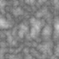
### Checkerboard
```kotlin
fun sponge_checkerboard(seed: Int, x: Int, y: Int): Double {
    val noise = Checkerboard()
    return noise.get(x.toDouble(), y.toDouble(), 0.0) - 0.5
}
```

### Const
```kotlin
fun sponge_const(seed: Int, x: Int, y: Int): Double {
    val noise = Const()
    noise.setValue(0.5)
    return noise.get(x.toDouble(), y.toDouble(), 0.0)
}
```

### Cylinders
```kotlin
fun sponge_cylinders(seed: Int, x: Int, y: Int): Double {
    val noise = Cylinders()
    noise.setFrequency(0.05)
    return noise.get(x.toDouble(), y.toDouble(), 0.0) - 0.5
}
```

### Perlin
```kotlin
fun sponge_perlin(seed: Int, x: Int, y: Int): Double {
    val noise = Perlin()
    noise.setSeed(seed)
    noise.setFrequency(0.05)
    return noise.get(x.toDouble(), y.toDouble(), 0.0) - 0.5
}
```
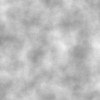

### RidgedMulti
```kotlin
fun sponge_ridgedmulti(seed: Int, x: Int, y: Int): Double {
    val noise = RidgedMulti()
    noise.setSeed(seed)
    noise.setFrequency(0.05)
    return noise.get(x.toDouble(), y.toDouble(), 0.0) - 0.5
}
```
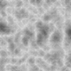

### RidgedMultiSimplex
```kotlin
fun sponge_ridgedmultisimplex(seed: Int, x: Int, y: Int): Double {
    val noise = RidgedMultiSimplex()
    noise.setSeed(seed)
    noise.setFrequency(0.05)
    return noise.get(x.toDouble(), y.toDouble(), 0.0) - 0.5
}
```
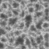

### Simplex noise
```kotlin
fun sponge_simplex(seed: Int, x: Int, y: Int): Double {
    val noise = Simplex()
    noise.setSeed(seed)
    noise.setFrequency(0.05)
    return noise.get(x.toDouble(), y.toDouble(), 0.0) - 1
}
```
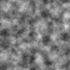

### Spheres
```kotlin
fun sponge_spheres(seed: Int, x: Int, y: Int): Double {
    val noise = Spheres()
    noise.setFrequency(0.05)
    return noise.get(x.toDouble(), y.toDouble(), 0.0) - 0.5
}
```
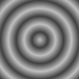

### Voronoi
```kotlin
fun sponge_voronoi(seed: Int, x: Int, y: Int): Double {
    val noise = Voronoi()
    noise.setSeed(seed)
    noise.setFrequency(0.05)
    return noise.get(x.toDouble(), y.toDouble(), 0.0) - 0.5
}
```
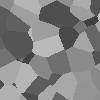

## Articdive/JNoiseを使用したノイズ生成
### Articdive/JNoiseについて
このライブラリは、C++のlibnoiseライブラリをもとに作成されています。

### インストール方法
[Articdive/JNoise](https://github.com/Articdive/JNoise) <br>
依存関係の設定<br>
build.gradle.kts
```kotlin
repositories {
    mavenCentral()
}

dependencies {
    implementation("de.articdive","jnoise-pipeline","4.1.0")
}
```

### FastSimplex
JNoiseでは、Simplexに[Open Simplex](https://en.wikipedia.org/wiki/OpenSimplex_noise)を<br> Spongepowered/Noiseでは、n次元ノイズ関数の[Simplex noise](https://en.wikipedia.org/wiki/Simplex_noise)が使用されているためseed値が一緒であっても結果が異なります。
```kotlin
fun jnoise_fastsimplex(seed: Int, x: Int, y: Int): Double {
    val noise =
    JNoise.newBuilder().fastSimplex(FastSimplexNoiseGenerator.newBuilder().setSeed(seed.toLong()).build()).scale(0.05)
    .build()
    return noise.evaluateNoise(x.toDouble(), y.toDouble())
}
```

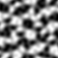

### SuperSimplex
```kotlin
fun jnoise_supersimplex(seed: Int, x: Int, y: Int): Double {
    val noise =
        JNoise.newBuilder().superSimplex(SuperSimplexNoiseGenerator.newBuilder().setSeed(seed.toLong()).build()).scale(0.05)
            .build()
    return noise.evaluateNoise(x.toDouble(), y.toDouble())
}
```

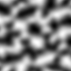

### CheckerBoard
```kotlin
fun jnoise_checkerboard(seed: Int, x: Int, y: Int): Double {
    val noise = CheckerboardNoiseGenerator.newBuilder().build()
    return noise.evaluateNoise(x.toDouble(), y.toDouble()) - 0.5
}
```

### Constant
```kotlin
fun jnoise_constant(seed: Int, x: Int, y: Int): Double {
    val noise = ConstantNoiseGenerator.newBuilder().setConstant(0.5).build()
    return noise.evaluateNoise(x.toDouble(), y.toDouble())
}
```

### Cylinders
```kotlin
fun jnoise_cylinders(seed: Int, x: Int, y: Int): Double {
    val noise = CylinderNoiseGenerator.newBuilder().build()
    return noise.evaluateNoise(x.toDouble(), y.toDouble(), 0.0) - 0.5
}
```
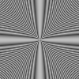

### GaussianWhiteNoise
```kotlin
fun jnoise_gaussianwhite(seed: Int, x: Int, y: Int): Double {
    val noise = GaussianWhiteNoiseGenerator.newBuilder()
        .setSeed(seed.toLong())
        .setMean(0.0)
        .setStandardDeviation(0.18)
        .build()
    return noise.evaluateNoise(x.toDouble(), y.toDouble())
}
```
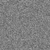
### Perlin
```kotlin
fun jnoise_perlin(seed: Int, x: Int, y: Int): Double {
    val noise = JNoise.newBuilder().perlin(PerlinNoiseGenerator.newBuilder().setSeed(seed.toLong()).build())
        .scale(0.05).build()
    return noise.evaluateNoise(x.toDouble(), y.toDouble())
}
```
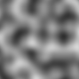
### Spheres
```kotlin
fun jnoise_spheres(seed: Int, x: Int, y: Int): Double {
    val noise = SphereNoiseGenerator.newBuilder().build()
    return noise.evaluateNoise(x.toDouble(), y.toDouble(), 0.0) - 0.5
}
```

### Value
```kotlin
fun jnoise_value(seed: Int, x: Int, y: Int): Double {
    val noise = JNoise.newBuilder().value(ValueNoiseGenerator.newBuilder().setSeed(seed.toLong()).build())
        .scale(0.05).build()
    return noise.evaluateNoise(x.toDouble(), y.toDouble())
}
```
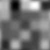
### White
```kotlin
fun jnoise_white(seed: Int, x: Int, y: Int): Double {
    val noise = JNoise.newBuilder().white(WhiteNoiseGenerator.newBuilder()).scale(0.05).build()
    return noise.evaluateNoise(x.toDouble(), y.toDouble())
}
```
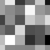
### Worley
```kotlin
fun jnoise_worley(seed: Int, x: Int, y: Int): Double {
    val noise = JNoise.newBuilder().worley(WorleyNoiseGenerator.newBuilder()).scale(0.05).build()
    return noise.evaluateNoise(x.toDouble(), y.toDouble())
}
```
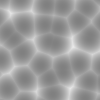


## 実行速度とその他の指標

!!! warning  

    min maxなどの値はコード内で表示用に改変してあるため、参考にする場合注意してください

約1,000,000回実行

主に実行速度を参考にしていただけると幸いです。

|name|speed|average|variance|min|max|
|----|-----|------|-----|-----|----|
| sponge-noise-simplex | 235ms | -0.0172 | 0.0505 | -0.8006 | 0.7837 |
| sponge-noise-billow | 124ms | 0.0649 | 0.0196 | -0.2500 | 0.7389 |
| sponge-noise-checkerboard | 45ms | 0.0000 | 0.2500 | -0.5000 | 0.5000 |
| sponge-noise-const | 30ms | 0.5000 | 0.0000 | 0.5000 | 0.5000 |
| sponge-noise-cylinders | 26ms | 0.0005 | 0.0852 | -0.5000 | 0.5000 |
| sponge-noise-perlin | 134ms | 0.4845 | 0.0132 | 0.0287 | 0.9659 |
| sponge-noise-ridgedmulti | 441ms | 0.3692 | 0.0260 | -0.3761 | 0.7305 |
| sponge-noise-ridgedmultisimplex | 637ms | 0.0759 | 0.0611 | -0.4997 | 0.7305 |
| sponge-noise-spheres | 43ms | 0.0004 | 0.0834 | -0.5000 | 0.5000 |
| sponge-noise-voronoi | 2160ms | -0.0078 | 0.0859 | -0.5000 | 0.5000 |
| jnoise-ceckerboard | 106ms | 0.0000 | 0.2500 | -0.5000 | 0.5000 |
| jnoise-constant | 32ms | 0.5000 | 0.0000 | 0.5000 | 0.5000 |
| jnoise-cylinders | 36ms | 0.0100 | 0.0854 | -0.4996 | 0.5000 |
| jnoise-fastsimplex | 192ms | -0.0002 | 0.2941 | -1.0000 | 1.0000 |
| jnoise-gaussianwhitenoise | 38ms | -0.0004 | 0.0324 | -0.8020 | 0.8560 |
| jnoise-perlin | 174ms | -0.0001 | 0.0702 | -1.0000 | 1.0000 |
| jnoise-spheres | 38ms | 0.0100 | 0.0854 | -0.4996 | 0.5000 |
| jnoise-supersimplex | 154ms | -0.0001 | 0.1745 | -0.9999 | 1.0000 |
| jnoise-value | 140ms | 0.0022 | 0.2079 | -0.9996 | 0.9996 |
| jnoise-white | 67ms | 0.0001 | 0.3469 | -0.9988 | 0.9988 |
| jnoise-worley | 582ms | 0.2221 | 0.0311 | 0.0000 | 1.3455 |